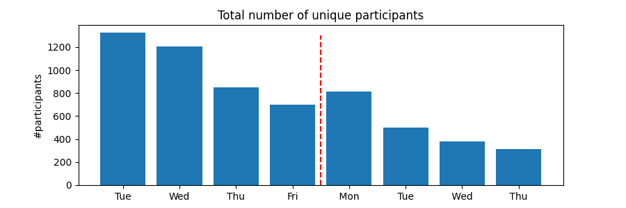
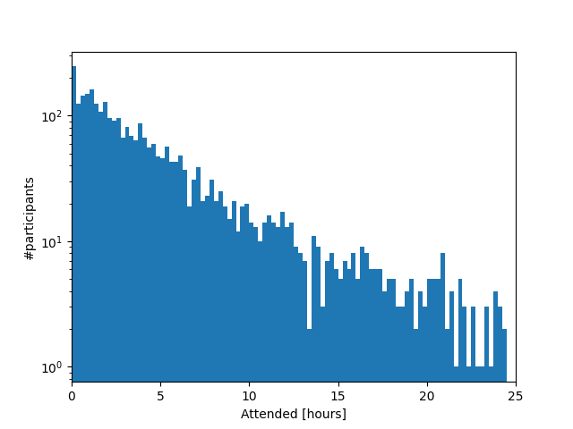
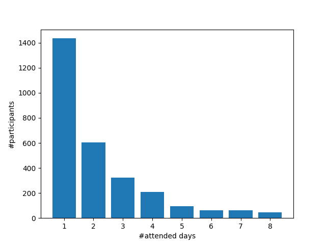

# Statistics of the ICHEP conference

## Parallel Sessions (Zoom)

### Number of unique participants for each day

### Number of unique participants for each session

### Histogram of time spent in parallel sessions per user

### Number of participants who stayed at least #hours at the conference

### Histogram of days spent at the conference

### Correlation between sessions
N(sessionX and sessionY) / min[N(sessionX), N(sessionY)] in [%]
i.e. [overlap coefficient](https://en.wikipedia.org/wiki/Overlap_coefficient)

