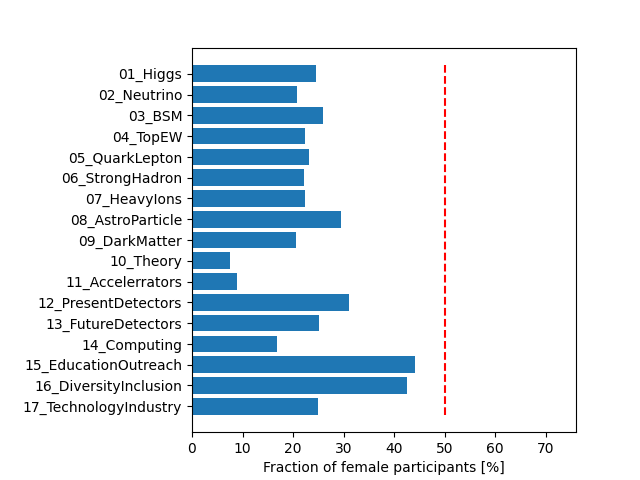
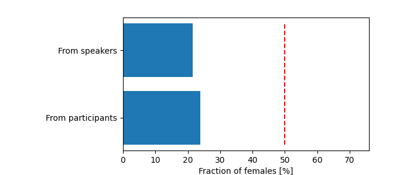

# Statistics of the ICHEP conference

## Counts

### Number of unique participants for each day

### Number of unique participants for each conference format

### Number of unique participants for each session

### Histogram of time spent at the conference per participant

### Number of participants who stayed at least #hours at the conference

### Histogram of days spent at the conference

## Correlations

### Correlation between conference formats
N(typeX and typeY) / min[N(typeX), N(typeY)] in [%]
i.e. [overlap coefficient](https://en.wikipedia.org/wiki/Overlap_coefficient)

### Isolation of the conference formats
Fraction of participants visiting only the particular session

### Correlation between sessions
N(sessionX and sessionY) / min[N(sessionX), N(sessionY)] in [%]
i.e. [overlap coefficient](https://en.wikipedia.org/wiki/Overlap_coefficient)

### Isolation of the sessions
Fraction of participants visiting only the particular session

### Gender profile of the sessions
Fraction of female participants across ICHEP sessions

### Gender profile of the sessions - Speakers
Fraction of female speakers across ICHEP sessions

### Gender profile of the whole conference

